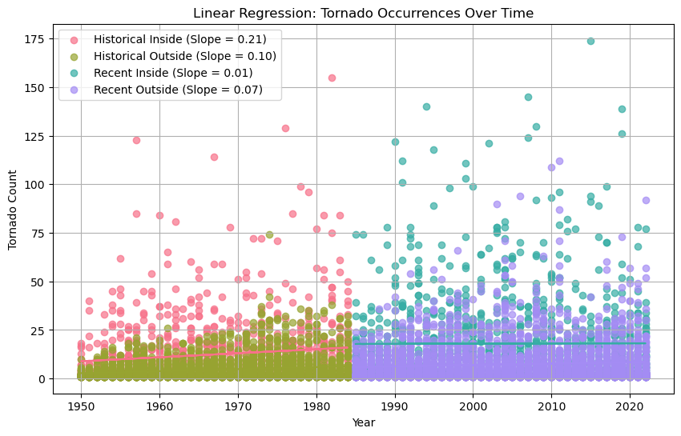
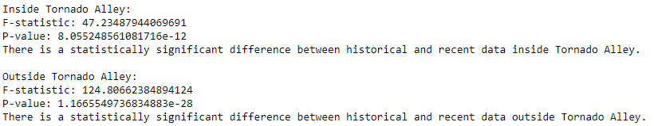
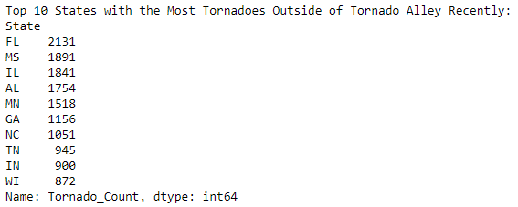
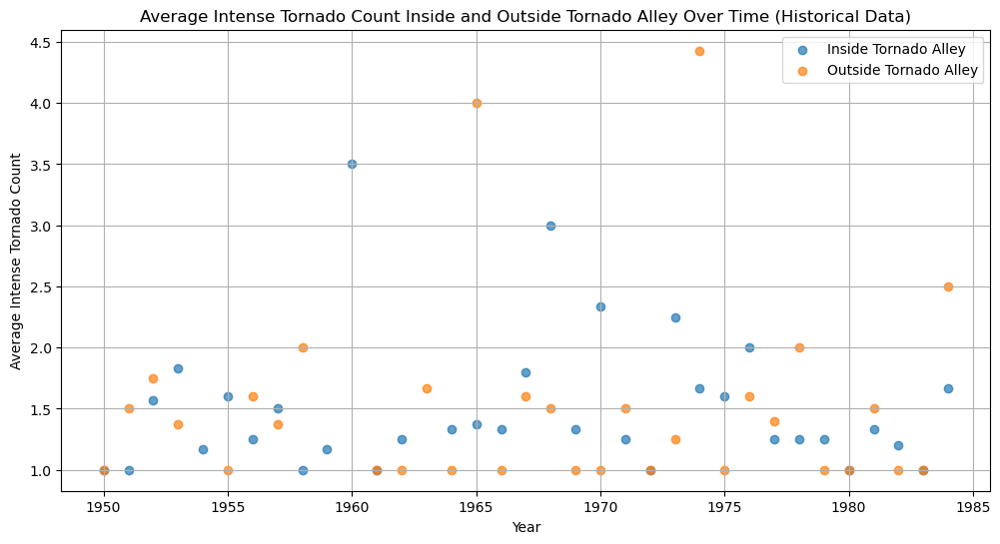
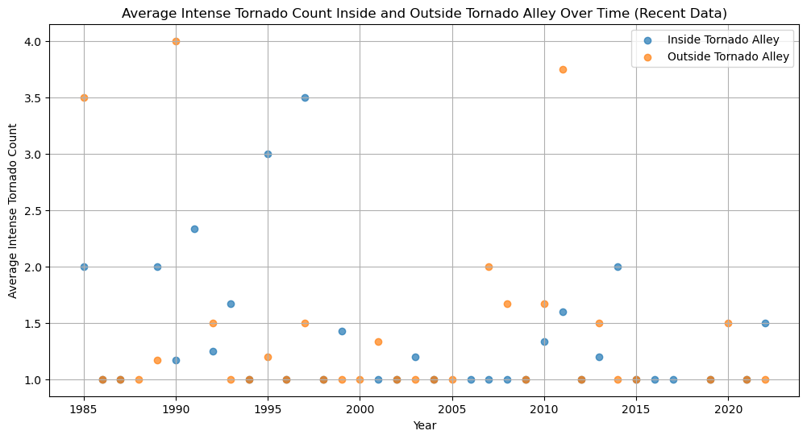
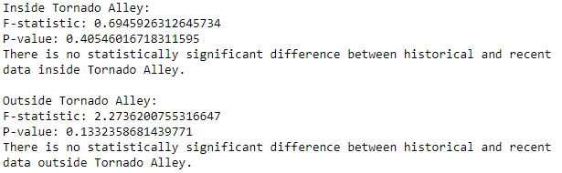
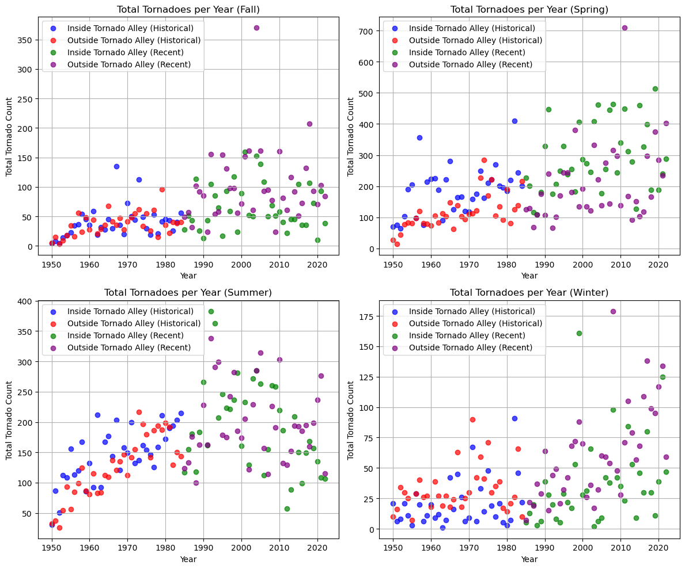
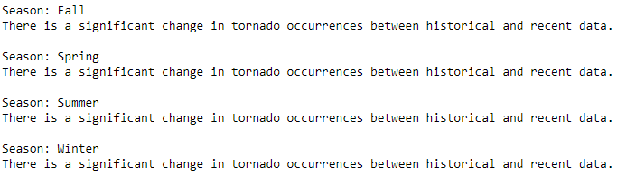

# Introduction

Tornadoes, one of nature's true mysteries, are subjects of fascination and concern in the United States. The central region of the United States, known as Tornado Alley, is renowned for its heightened susceptibility to tornadoes. However, recent developments suggest that Tornado Alley's historical boundaries may be shifting towards the Central-Southeastern regions of the United States. This project aims to shed light on whether changes in the frequency, intensity, and geographic occurrence of tornadoes are indeed unfolding over time.
 

# Key questions

This data analysis project aims to investigate these questions:

1. Is Tornado Alley shifting elsewhere
2. Is tornado intensity consistent over time?
3. Are there changes in seasonal tornado patterns?
 

# Findings
## 1. Tornado Alley's geographic location is shifting to the Southeast US.

 

## 2. There have been no significant changes in tornado intensity

 

## 3. Tornado seasonality is shifting

 

## 4. Link to interactive Tableau visualization <a href="https://public.tableau.com/shared/SBSB4JS3X?:display_count=n&:origin=viz_share_link">here</a>

