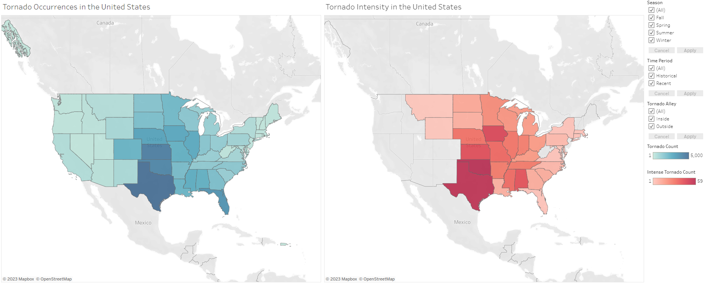

# Introduction

Tornadoes, one of nature's true mysteries, are subjects of fascination and concern in the United States. The central region of the United States, known as Tornado Alley, is renowned for its heightened susceptibility to tornadoes. However, recent developments suggest that Tornado Alley's historical boundaries may be shifting towards the Central-Southeastern regions of the United States. This project aims to shed light on whether changes in the frequency, intensity, and geographic occurrence of tornadoes are indeed unfolding over time.
 

# Key questions

This data analysis project aims to investigate these questions:

1. Is Tornado Alley shifting elsewhere
2. Is tornado intensity consistent over time?
3. Are there changes in seasonal tornado patterns?

# Findings

## 1. Tornado Alley's geographic location is shifting to the Southeast US.
This visualization shows  the trends of tornado occurrences inside and outside Tornado Alley, comparing historical and recent data. We see a larger slope for "Recent Outside" than "Recent Inside" which suggests the number of tornadoes outside Tornado Alley is increasing faster than those inside Tornado Alley. 

 

I used ANOVA statistical testing to test differences between historical and recent data. This determined a significant difference between historical tornado trends and recent ones.

 

I created a list of the Top Ten States to see which states outside of Tornado Alley were experiencing the most tornadoes. Most of these are located in the Southeast United States.
 

 

## 2. There have been no significant changes in tornado intensity
I created two scatter plots to compare historical and recent tornado intensities. 

Then I used ANOVA statistical testing to determine if there was a significant difference between historical and recent tornado intensity. This returned insignificant differences between the two time periods.

 

## 3. Tornado seasonality is shifting
I created four scatter plots (one for each season) to visualize tornado occurrence across the four seasons. These were color-coordinated by time period and location to visualize trends in tornado seasonality.

Using ANOVA statistical testing, I determined there was a significant change between historical and recent data for each season, indicating a seasonal shift. However, we don't know where seasonality is shifting. 

 

To determine this, I used linear regression analysis to see the slope of each season (historically and recently). This showed an increase in Spring tornadoes and, surprisingly, Winter tornadoes. This indicates a seasonal shift in tornado activity. 

## 4. Tableau visualization - <a href="https://public.tableau.com/shared/SBSB4JS3X?:display_count=n&:origin=viz_share_link">here</a>
I created an interactive Tableau dashboard for this project to visualize trends in geographic location, time period, and seasonality. 

